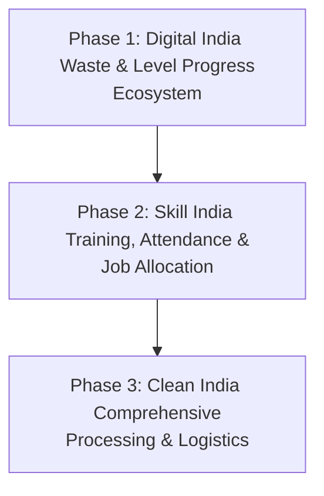
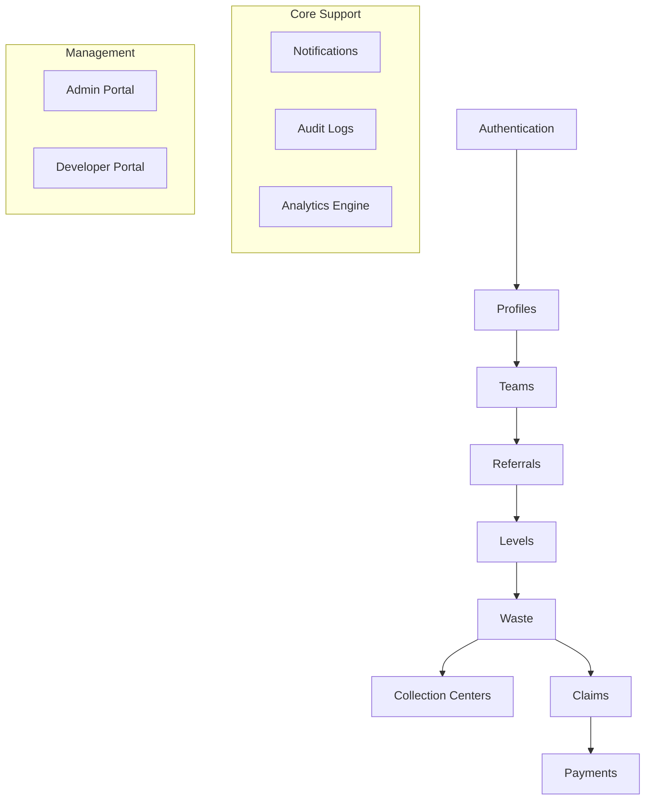
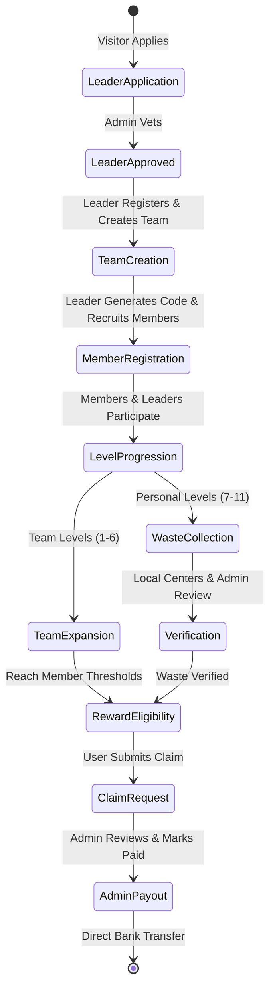

# Athiyaman Platform - Master Context Document

> [!IMPORTANT]
> **SOURCE OF TRUTH:** This document serves as the permanent master context and technical source of truth for the Athiyaman Platform. Every future AI development session, engineer, and architect **MUST** load and adhere strictly to this context before generating database schemas, developing API endpoints, constructing frontend interfaces, or executing deployments.

---

## 1. Project Identity

### 1.1 Platform Information
*   **Project Name:** Athiyaman Platform
*   **Current Phase:** Phase 1 – Digital India
*   **Target Domain:** Community-driven resource collection, decentralized socio-economic level progression, and digital record transparency.

### 1.2 Platform Phases Roadmap

*   **Phase 1: Digital India (Current):** Establish the core digital infrastructure. Focuses on team creation, structured referral registrations, user level progression (team and personal levels), waste collection verification, collection center geolocating, and direct reward claim processing.
*   **Phase 2: Skill India (Future):** Introduce trainers, training modules, courses, assignments, assessments, certifications, job allocations, and salary tracking to empower citizens with technical skills.
*   **Phase 3: Clean India (Future):** Scale waste processing. Introduce new roles like Center Managers, Center Staff, and District Coordinators, along with logistics management, transport records, and advanced district/state environmental reporting.

### 1.3 Platform Purpose
The Athiyaman Platform is a centralized digital ecosystem designed to incentivize civic participation in nation-building and environmental programs. By providing structured, referral-based team-building and individual waste collection modules, the platform enables citizens to level up, earn financial rewards, and directly contribute to local development. It bridges public action with structured government/organizational rewards through a high-integrity, completely traceable, and auditable digital workflow.

---

## 2. Project Vision

### 2.1 Long-Term Platform Vision
To create the leading, self-sustaining civic engagement platform in India, where individual micro-actions (such as waste recycling and skill acquisition) translate directly into verifiable community growth, certified credentials, and financial rewards. The platform aims to redefine civic responsibility by making it gamified, financially viable, and completely transparent.

### 2.2 Digital India Goals
*   **Zero-Paper Digital Workflows:** All applications, profile verification documents (Aadhaar, Bank Proofs), waste records, and reward approvals exist strictly within a secure digital ledger.
*   **Complete Administrative Control:** Centralized monitoring engines that prevent fraudulent claims, ensuring every single Rupee of reward is linked to verified personal work or validated team expansion.
*   **Accessible Citizen Dashboards:** Intuitive, lightning-fast digital layouts accessible across diverse devices and low-bandwidth connections, ensuring maximum financial inclusion.

### 2.3 Growth & Expansion Strategy
*   **District-to-National Scale:** Initiate pilot operations in specific administrative districts (e.g., Madurai), refining verification models and collection center logistics, before scaling state-wide and nationally.
*   **Modular Progression:** The platform is designed from day one to accommodate Phase 2 (Skill India) and Phase 3 (Clean India) modules without core structural rewrites, maintaining identical authentication, profile, audit, and payment modules.
*   **Sustainability & Circular Economy:** Partnering local recycling collection centers with public and corporate CSR budgets to guarantee the long-term financial viability of the platform's reward distribution model.

---

## 3. Development Philosophy

The development of the Athiyaman Platform is guided by six core principles, ordered in strict priority:

```
┌────────────────────────────────────────────────────────┐
│                      SECURITY FIRST                    │
├────────────────────────────────────────────────────────┤
│                   BUSINESS LOGIC FIRST                 │
├────────────────────────────────────────────────────────┤
│                     SCALABILITY FIRST                  │
├────────────────────────────────────────────────────────┤
│                  MAINTAINABILITY FIRST                 │
├────────────────────────────────────────────────────────┤
│                   AUDITABILITY FIRST                   │
├────────────────────────────────────────────────────────┤
│                  USER EXPERIENCE FIRST                 │
└────────────────────────────────────────────────────────┘
```

1.  **Security First:** The platform processes highly sensitive citizen data, including Aadhaar numbers, direct bank account numbers, physical addresses, and financial transaction histories. Security cannot be compromised for feature speed or visual presentation.
2.  **Business Logic First:** Core business rules (such as one-leader-one-team limits, strict level-progression logic, and claim boundaries) must be enforced at the service layer in the backend, completely independent of the UI or client-side validations.
3.  **Scalability First:** The schema design, API structure, and database queries must support rapid scaling to hundreds of thousands of active users and millions of audit/waste logs without performance degradation.
4.  **Maintainability First:** Adhere strictly to the Repository and Service patterns. Code must be highly modular, explicitly typed, self-documenting, and easy to transition between development teams.
5.  **Auditability First:** Every single state change—whether a user logs in, completes a profile, updates bank details, uploads a waste record, verifies weights, or approves a payout—must be permanently logged in a read-only, immutable audit trail.
6.  **User Experience First (Functionality & Accessibility over Polish):** 

> [!WARNING]
> **NO FLASHY EFFECTS:** The platform is intended to be used by ordinary citizens, leaders, and government/operational admins, many of whom access the portal on budget mobile devices under low-bandwidth network conditions. Flashy 3D animations, complex parallax scrolling, large bundle-size libraries, and intensive visual rendering are **strictly prohibited**. The UI must feel clean, trustworthy, high-contrast, government-like, professional, and load near-instantaneously. Focus strictly on intuitive workflows, accessibility standards, and clean, responsive layouts.

---

## 4. Platform Principles

*   **Data Integrity:** Complete structural validation. No dangling relationships are allowed in the database. Every transaction, level progression, and team member link must utilize strict relational constraints and transaction boundaries.
*   **Transparency:** Citizens can track the exact status of their waste submissions, verified weights, level completion milestones, and payment disbursements in real-time, eliminating administrative opacity.
*   **Traceability:** Every waste record's transition (from submitted to pending, verified, or rejected) is documented linearly in the `waste_status_history` ledger, pinpointing which collection center and admin reviewed it.
*   **Accountability:** Admins and developers can never perform arbitrary mutations on data. All actions are attributed to a validated system account and logged alongside physical IP addresses and device details.
*   **Modularity:** The codebase is split into feature-based subdirectories rather than generic layer directories. This prevents code overlap and guarantees that adding Phase 2/3 does not conflict with Phase 1 components.
*   **Extensibility:** Core systems (e.g., authentication, payments, levels configuration) are designed using abstract class structures, allowing new verification providers or payment models to be integrated without altering core logic.
*   **Reliability:** Strict type systems, error catch-all wrappers, and automated test runners ensure the platform remains robust under operational load.

---

## 5. Technology Decisions

The Athiyaman Platform utilizes a robust, modern, and light-weight technology stack curated for high dependability, rapid development, and low hosting overhead.

### 5.1 Frontend Stack

| Technology | Purpose | Reason for Selection | Key Benefits |
| :--- | :--- | :--- | :--- |
| **React** | User Interface library | Standardized component structure, high performance with Virtual DOM, robust ecosystems for forms and queries. | Promotes highly reusable, isolated components; makes scaling UI features fast and bug-free. |
| **TypeScript** | Static typing layer | Catches coding errors and contracts mismatch during development before code compiles. | Complete code completion, self-documenting API responses, and massive reduction in runtime null-pointer crashes. |
| **Tailwind CSS** | Styling engine | Utility-first CSS utility framework allowing custom government-style high-contrast theme mapping. | Highly responsive out-of-the-box, extremely small build size, zero custom CSS bloat, clean styling consistency. |
| **React Router** | Client-side routing | Handles nested routes, page-transitions, and dashboard layouts. | Smooth Single Page App (SPA) experience; handles role-based client-side route protection natively. |
| **React Query** *(TanStack)* | Server state synchronizer | Manages all API data fetching, caching, automated background refetching, and request states (loading, error). | Eliminates custom fetching boilerplate; drastically reduces server load via caching; provides optimistic UI updates. |

### 5.2 Backend Stack

| Technology | Purpose | Reason for Selection | Key Benefits |
| :--- | :--- | :--- | :--- |
| **Python** | Core backend language | Highly readable, secure syntax, excellent data handling, and extensive ecosystem for utility libraries. | Fast development cycles, native support for analytical scripts, and rich enterprise-grade framework support. |
| **FastAPI** | REST API framework | High-performance asynchronous execution (ASGI), out-of-the-box OpenAPI/Swagger documentation, native Pydantic validation. | Unmatched request speeds, automated and strictly typed request/response schema parsing, and low resource overhead. |
| **SQLAlchemy** | ORM (Object Relational Mapper) | Python’s premier enterprise ORM. Combines relational design with object modeling. Protects natively against SQL Injection. | Clean Python representation of database schemas, flexible query generation, and seamless integration with PostgreSQL. |
| **Alembic** | DB migrations manager | Companion database migration tool for SQLAlchemy. | Tracks database schema evolution over time via version-controlled script files, guaranteeing safe production deploys. |
| **Pydantic** | Validation & settings | Strict runtime validation of system configuration, request bodies, and database payloads using Python type hints. | Guaranteed input sanitization, precise API contract validation, and clear error responses when inputs fail contracts. |

### 5.3 Database & Infrastructural Infrastructure

| Component | Technology | Purpose & Selection Rationale |
| :--- | :--- | :--- |
| **Database** | **PostgreSQL** | Enterprise-grade, open-source relational database. Essential for strict ACID compliance required in financial calculations. Provides native JSONB columns for flexible configuration storage, complex analytical query capabilities, and excellent performance with indexes. |
| **Authentication** | **JWT (JSON Web Tokens)** | Stateless token-based authorization. Ensures the backend API is stateless, highly performant, and easily scaled across load-balancers. Access tokens carry role metadata for rapid validation, coupled with secure HTTP-only refresh tokens. |
| **Storage** | **Local File Storage** | Designed initially to run efficiently on direct-directory file storage (for compatibility with local servers and cost control). Utilizes abstract adapter interfaces in code, permitting instantaneous migration to **AWS S3** or other Object Storage backends via config file adjustments. |
| **Maps Provider** | **Google Maps API** | Provides geocoding, geocoordinate queries (Latitude & Longitude), and interactive distance sorting to direct citizens dynamically to their nearest waste collection centers. |
| **Notifications** | **SMS, Email, WhatsApp** | SMS and email serve as direct notification channels for standard users (signup OTPs, payment status alerts). WhatsApp APIs are integrated for critical operational notifications and real-time developer/admin system alerts. |
| **Hosting Environment** | **Linux / DirectAdmin** | Configured to support light-weight, highly portable dockerized containers or standard WSGI/ASGI deployments. DirectAdmin compatibility ensures host portability and low maintenance costs in administrative setups. |

---

## 6. Architecture Philosophy

The architecture of the Athiyaman Platform isolates layers cleanly, ensuring that code changes are localized and business logic remains bulletproof.

```
┌────────────────────────────────────────────────────────┐
│                      Presentation Layer                │
│                 (React / TypeScript / Tailwind)        │
└───────────────────────────┬────────────────────────────┘
                            │ (JSON over HTTP)
                            ▼
┌────────────────────────────────────────────────────────┐
│                       Controller Layer                 │
│                 (FastAPI Routers / HTTP Handlers)      │
└───────────────────────────┬────────────────────────────┘
                            │ (Pydantic DTOs)
                            ▼
┌────────────────────────────────────────────────────────┐
│                        Service Layer                   │
│             (Pure Business Logic / Workflows / Levels) │
└───────────────────────────┬────────────────────────────┘
                            │ (Repository Interfaces)
                            ▼
┌────────────────────────────────────────────────────────┐
│                      Repository Layer                  │
│               (SQLAlchemy ORM / Raw DB Queries)        │
└───────────────────────────┬────────────────────────────┘
                            │
                            ▼
┌────────────────────────────────────────────────────────┐
│                       Database Tier                    │
│                        (PostgreSQL)                    │
└────────────────────────────────────────────────────────┘
```

### 6.1 Core Architectural Patterns
*   **Clean Architecture & Service Layer Pattern:** The backend decouples HTTP controller details from business logic. Controllers receive requests, validate schemas using Pydantic, and delegate execution to isolated Service classes (e.g., `TeamService`, `WasteService`). Servicing functions process coordinates, apply level logic, and call the Repository layer for persistence.
*   **Repository Pattern:** Repositories handle all raw database interactions. Business services never write raw SQL or manage session lifetimes directly. This separates relational details (like ORM joins) from clean business operations.
*   **Feature-Based Folder Architecture:**
    *   *Frontend:* Standardized layout where components, routes, types, and custom hooks are grouped under feature modules (`features/auth/`, `features/teams/`, `features/waste/`).
    *   *Backend:* Isolated modules (`app/teams/`, `app/waste/`) housing their own routers, models, schemas, and services, preventing directory bloating.
*   **Dependency Injection (DI):** Leveraging FastAPI's native dependency injection engine to inject database sessions and active service instances into endpoints dynamically. This dramatically simplifies testing via repository mocking.
*   **Role-Based Access Control (RBAC):** Every endpoint is strictly guarded by custom declarative dependency annotations. Requests are audited against JWT user payloads, rejecting unauthorized access at the gateway level.
*   **Audit Logging Engine:** Built-in middleware and services capture system-wide mutations. Audit logs are written asynchronously to database records, capturing context (IP, device info, active session UUID, old/new states) to maintain absolute accountability.

---

## 7. System Modules

Phase 1 consists of 14 integrated backend and frontend modules:



1.  **Authentication Module:** Handles secure signup (referral validation forced), OTP generation, multi-channel OTP verification (SMS/Email), Argon2 secure password hashing, JWT token creation, secure HTTP-only refresh tokens, and password reset flows.
2.  **Profiles Module:** Manages complete user biographical data, nominee details, and bank routing info. Computes an absolute profile-completion progress indicator ($0\%$ to $100\%$). Locked dashboards are released only upon $100\%$ profile completion and explicit rules acceptance.
3.  **Teams Module:** Handles team creation, enforces unique team name constraints across the platform, establishes team-leader hierarchy, and maps team lists to respective districts, areas, and pincodes.
4.  **Referrals Module:** Generates two distinct referral types: `LEADER_REFERRAL` (generated only by Admins to register vetted leaders) and `TEAM_REFERRAL` (generated by Leaders to recruit team members). Implements strict counter limits and usage histories.
5.  **Levels Module:** The platform engine that tracks progression:
    *   *Team Levels (1–6):* Incremented by Leaders based on total verified team members ($10$ to $50,000$).
    *   *Personal Levels (7–11):* Incremented individually by all users based on collecting $10\text{ KG}$ of verified waste per level.
6.  **Waste Module:** Manages the lifecycle of waste records: user submission with photo uploads, GPS coordinates, center selection, Admin queue routing, approval/rejection state transitions, and logging in the history timeline.
7.  **Collection Centers Module:** Admin-managed dictionary of authorized physical centers geocoded by latitude/longitude, searchable by district or pincode, and complete with contact details and Google Maps navigability.
8.  **Claims Module:** Translates level completion events into financial requests. Initiated by users when level-ups occur. Tracks claim type (`TEAM_REWARD` / `PERSONAL_REWARD`), amount configuration, and approval queues.
9.  **Payments Module:** Financial ledger system. Admin logs payment execution, stores transaction reference numbers, records dates of disbursement, and changes claim status from pending to paid.
10. **Notifications Module:** Built-in dashboard inbox broadcasting system. Can target all users, specific roles, specific teams, or individual users, and logs exact delivery timelines.
11. **Audit Module:** Permanently records administrative and technical activity logs in an immutable table, tracking user ID, role, action, targeted entity ID, IP, device context, and timestamp.
12. **Analytics Module:** Aggregates analytics asynchronously. Exposes historical growth charts, top-performing teams, waste collection milestones, and payment processing statistics.
13. **Admin Module:** Operational interface. Incorporates screens for leader application vetting, user activation/suspension, team monitoring, waste photo verification queues, reward claim auditing, and payment processing.
14. **Developer Module:** Technical control center. Hosts screens for system health stats (CPU/Memory/Active DB Pools), security vulnerability tracking, real-time log explorer, database backup triggers, and modular feature flags.

---

## 8. User Roles & Boundaries

The platform strictly enforces five user personas:

```
┌────────────────────────────────────────────────────────┐
│                        Developer                       │
├────────────────────────────────────────────────────────┤
│                          Admin                         │
├────────────────────────────────────────────────────────┤
│                          Leader                        │
├────────────────────────────────────────────────────────┤
│                          Member                        │
├────────────────────────────────────────────────────────┤
│                         Visitor                        │
└────────────────────────────────────────────────────────┘
```

### 8.1 Visitor
*   **Definition:** Unregistered or anonymous portal guest.
*   **Responsibilities:** Learns about platform objectives via public website pages (Home, About, Initiatives, Waste Info, Contact).
*   **Boundaries:**
    *   *Allowed:* Read public resources, apply to become a Team Leader by submitting the application form.
    *   *Forbidden:* Access any dashboard, view private profile states, view collection center phone lines, view team referral structures.

### 8.2 Team Member
*   **Definition:** Active platform participant registered through a valid leader referral code.
*   **Responsibilities:** Join a team, participate in waste collection programs, log collections, and track rewards.
*   **Boundaries:**
    *   *Allowed:* Manage personal profile, upload personal waste records, view nearest collection centers, track personal level progress (Levels 7-11), create personal reward claims, view personal payment histories.
    *   *Forbidden:* Create teams, generate referral codes, access admin verify screens, modify configuration files.

### 8.3 Team Leader
*   **Definition:** Vetted platform participant approved by Admins to build and manage a local team. Encompasses both Leader duties and individual participant duties.
*   **Responsibilities:** Establish a unique team, recruit members, track team growth, and participate in personal waste collection.
*   **Boundaries:**
    *   *Allowed:* All Team Member actions, create and manage a single team, generate team referral codes, view read-only member rosters, track team level progress (Levels 1-6), claim team reward achievements.
    *   *Forbidden:* Approve other team leaders, modify user account statuses, bypass level validation systems, access developer monitoring utilities.

### 8.4 Admin
*   **Definition:** Platform manager responsible for daily operational control.
*   **Responsibilities:** Vetting users, reviewing documents, verifying physical assets, and coordinating reward payments.
*   **Boundaries:**
    *   *Allowed:* Approve/reject leader applications, generate initial leader registration referral codes, view and verify citizen document uploads, review waste uploads in the queue (approve/reject weights), audit reward claims, log transaction references.
    *   *Forbidden:* Modify raw code, bypass database integrity logs, access developer security consoles, directly mutate database rows outside of the audit logging API.

### 8.5 Developer
*   **Definition:** Technical administrator responsible for portal maintenance and system stability.
*   **Responsibilities:** System health monitoring, database safety, security log reviews, and infrastructure configurations.
*   **Boundaries:**
    *   *Allowed:* View system health diagnostics, explore real-time application logs, trigger full/incremental database backups and restores, toggle modular feature flags.
    *   *Forbidden:* Mutation of user bank accounts, approval of financial reward claims, bypassing audit logs. All technical configurations must be performed via auditable tools.

---

## 9. Business Model Overview

The Athiyaman business engine relies on high user retention, transparent incentivization, and strict verification checkpoints to prevent systemic fraud.



### 9.1 Core Workflows
1.  **Leader Application & Vetting:** Visitors apply to become leaders. Admins perform offline/online validation of their Aadhaar credentials, geographic district capacity, and background notes. Upon approval, a specialized `LEADER_REFERRAL` code is generated and sent via email/SMS.
2.  **Referral-Based Onboarding:** Signups are strictly closed-loop. There is no open public registration. Users register only by inputting valid referrals:
    *   Admins generate codes for Leaders.
    *   Leaders generate codes for Members.
3.  **The One Leader, One Team Rule:** A leader can create, name, and own exactly one team. Team names must be unique across the platform to avoid mimicry. Leadership is non-transferable without Admin overriding.
4.  **Profile Completeness Lock:** Registered users cannot access their dashboards until their personal profile photo, email, address, Aadhaar number, verified bank account number, and nominee details are fully submitted ($100\%$ complete) and they accept the platform's rules.
5.  **Sequential Progression Engine:** Progression is strictly linear. Skip-level actions are prevented at the database and service layers.
    *   Leaders complete Level 1 first, unlock Level 2, and progress sequentially.
    *   Members and Leaders track personal waste weights sequentially through levels 7 to 11.
6.  **Claim & Verification Separation & Duplicate Claim Prevention:** Reaching a level milestone does not trigger automatic bank transfers. Level-ups change eligibility state, allowing the user to initiate a manual `Claim Request`. Admins verify Aadhaar records and bank configurations before approving claims.
    *   **Duplicate Claim Prevention Standards:** The claims engine strictly blocks duplicate payout requests. The workflow follows:
        $$\text{Level Completed} \rightarrow \text{Claim Created} \rightarrow \text{Claim Pending} \rightarrow \text{Admin Review} \rightarrow \text{Approved or Rejected}$$
        *   No second claim is permitted for any level milestone.
        *   No second claim can be created while a claim is in `PENDING` state.
        *   Progress is locked during claim review; new progress accumulated is separate and stored in future level buckets, preventing double-claiming.
7.  **Direct Bank Disbursement:** Admins execute payments, log official transaction references from banking portals, and mark the claim as Paid. This updates the user dashboard, records the timestamp, and pushes a receipt notification.

---

## 10. Platform Workflow Overview

The linear flow of the Athiyaman platform is structured to maintain digital tracking from landing page to payout.

```
                  [ PUBLIC LANDING PAGE ]
                             │
                             ▼ (Applies as Leader)
                  [ LEADER APPLICATION ]
                             │
                             ▼ (Admin Vets Aadhaar & Location)
                  [ ADMIN APPROVAL ]
                             │
                             ▼ (SMS/Email Notification)
               [ LEADER REFERRAL CODE ISSUED ]
                             │
                             ▼ (Sign Up with Code)
                   [ LEADER REGISTRATION ]
                             │
                             ▼ (Enter Bank Details & Nominee)
                 [ 100% PROFILE COMPLETION ]
                             │
                             ▼ (Explicit Click Wrap)
                 [ ACCEPT PLATFORM RULES ]
                             │
                             ▼ (Locked Dashboard Released)
                     [ CREATE TEAM ]
                             │
                             ▼ (Generate Member Referral)
                  [ RECRUIT TEAM MEMBERS ]
                             │
                             ▼ (Members Sign Up with Code)
                   [ MEMBER REGISTRATION ]
                             │
            ┌────────────────┴────────────────┐
            ▼                                 ▼
   [ TEAM LEVEL EXPANSION ]        [ INDIVIDUAL WASTE ACTIVITY ]
   * Levels 1–6 (Team Size)        * Levels 7–11 (Waste Weights)
   * Managed by Leader             * Managed by Members & Leaders
   * 10 to 50,000 Members          * 10 KG Verified Waste per Level
            │                                 │
            └────────────────┬────────────────┘
                             ▼
                  [ LEVEL UP ACHIEVED ]
                             │
                             ▼ (User Requests Payout)
                   [ SUBMIT REWARD CLAIM ]
                             │
                             ▼ (Admin Audits Log & Documents)
                    [ ADMIN APPROVAL ]
                             │
                             ▼ (Mark Paid & Add Bank Tx Reference)
                 [ DIRECT BANK DISBURSEMENT ]
```

---

## 11. Security Philosophy

The Athiyaman Platform applies enterprise-grade security protocols across all software layers:

*   **Authentication & Session Management:**
    *   Passwords must be hashed using high-computation **Argon2id** algorithms, preventing brute-force compromises.
    *   Authentication APIs issue short-lived JWT access tokens ($15\text{ minutes}$) containing user identity and role scopes.
    *   Session persistence utilizes HTTP-only, secure, `SameSite=Strict` cookies hosting refresh tokens ($7\text{ days}$) to block Cross-Site Scripting (XSS) and Cross-Site Request Forgery (CSRF).
*   **Role-Based Access Control (RBAC):**
    *   Strict, server-side route guards. A Team Member trying to reach `/api/v1/admin/*` is blocked at the FastAPI router injection layer, throwing an immediate `403 Forbidden` response.
    *   Role boundaries are enforced within SQL queries using session-bounded conditions (e.g., matching requested user records directly to the authenticated caller's JWT user ID).
*   **Input & Document Validation:**
    *   All external payloads undergo strict schema enforcement via Pydantic, escaping characters to block SQL injection and Cross-Site Scripting (XSS).
    *   Document upload engines allow only certified MIME-types (`image/jpeg`, `image/png`, `application/pdf`).
    *   Uploaded files are dynamically renamed with UUID paths and checked for size boundaries ($5\text{MB}$ maximum) to prevent disk space exhaustion.
*   **Rate Limiting & Threat Prevention:**
    *   API gateways apply strict rate limits (e.g., standard endpoints capped at $60\text{ requests/minute}$; authentication points limited to $5\text{ attempts/minute}$ per IP).
    *   Consecutive failed logins lock user accounts temporarily, notifying developers via the Security Center interface.
*   **Comprehensive Audit Logs:**
    *   Every business transaction writes to the `audit_logs` table.
    *   Audit logs contain: User UUID, active role, action type, entity ID, request IP address, client device footprint, and timestamp.
    *   **Audit Immutability standards:** Audit logs are permanent. The database blocks any update and delete operations on `audit_logs`, `notification_logs`, and `payment_audit_logs` tables, enforcing a strict *INSERT-only* immutable registry to prevent fraud and maintain investigation integrity.

---

## 12. Privacy Philosophy

Citizen privacy is protected through strict compliance with digital privacy standards:

*   **Personally Identifiable Information (PII) Security Standards:**
    *   **Aadhaar Security Protocols:** Storing plain text Aadhaar numbers is strictly prohibited. The database uses `aadhaar_encrypted` for display/verification (masked as `XXXX-XXXX-1234` on dashboards) and a cryptographic `aadhaar_hash` for duplicate application/account detection.
    *   **Bank Data Security Protocols:** Bank accounts are treated as highly sensitive data. Information must be encrypted at rest, masked as `XXXXXX4589` in dashboards, restricted to authorized workflows, and any access attempts must trigger an immediate high-priority entry in `audit_logs`.
*   **Physical Document Security:**
    *   Citizen document scans (Aadhaar cards, bank passbooks, check leaf proofs) are saved in secure, non-public storage directories.
    *   These documents are served to authorized Admins via temporary, expiring secure URLs.
*   **Data Minimization:**
    *   The platform gathers only data vital to verifying identity, geographical capacity, and bank transfers, avoiding unneeded tracking metrics.
*   **Retention & Nominee Policies:**
    *   Inactive profiles are retained according to organizational retention guidelines.
    *   Nominee details are strictly isolated, used only as a safety protocol in the event of level progression disputes.

---

## 13. Scalability Philosophy

The platform's technology choices ensure simple horizontal and database expansion:

*   **Stateless Backend Processing:**
    *   The FastAPI application is stateless. All authentication depends on self-contained JWT tokens.
    *   This ensures the backend can scale horizontally across multiple instances behind a load balancer without shared session memory bottlenecks.
*   **Database Performance Design:**
    *   Relational columns undergo intensive indexing on frequently searched fields (e.g., `username`, `phone_number`, `team_code`, `verification_status`).
    *   Analytical dashboards pull from a pre-calculated table (`analytics_snapshots`) calculated asynchronously. This prevents heavy, real-time aggregate calculations from locking transactional tables during peak hours.
    *   **Queue-Based Asynchronous Workers:** Heavy operations (including Payment Processing, Notification Delivery, Analytics Aggregation, Report Generation, Audit Aggregation, and Document Processing) must execute asynchronously via queue-based background workers, avoiding long-running user threads.
    *   **Performance Requirements:** The database engine and queries are optimized to maintain dashboard load times below **2 seconds**, search lookups below **1 second**, and API responses below **500 ms**. Mandatory pagination is enforced for Users, Teams, Members, Waste Records, Payments, Audit Logs, and Notifications.
*   **Interface Abstraction for Expansion:**
    *   *Storage:* Files use abstract storage managers. Transitioning from local folders to AWS S3 requires only updating environment configurations.
    *   *Payments & SMS:* Core services utilize notification and transaction interfaces. Swapping local SMS gateways for international ones or linking external UPI payment hubs is simple and does not impact business logic.

---

## 14. Coding Standards

Every line of code written for the Athiyaman Platform must adhere to the highest engineering standards:

### 14.1 Frontend Standards (React / TypeScript)
*   **TypeScript Strict Mode:** `"strict": true` is mandatory. Avoid the `any` type. Define explicit typings for all component props, states, hooks, and API payloads.
*   **Clean Component Structures:** Focus components on a single responsibility. Business logic, mathematical conversions, and data fetching must live inside custom hooks or service structures, keeping UI files clean and focused on rendering layout.
*   **Consistent Component Folder layout:**
    ```
    features/waste/
    ├── components/         # Local UI elements (cards, forms)
    ├── hooks/              # Custom React Query hooks (useWasteRecords)
    ├── services/           # Axios API call methods (wasteApi.ts)
    ├── types/              # TS interface definitions (waste.types.ts)
    └── WasteOverview.tsx   # Feature container page
    ```
*   **Tailwind Consistency:** Use custom design system tokens defined in Tailwind configs (e.g., `bg-primary-blue`, `text-secondary-green`). Do not write arbitrary inline pixels or custom CSS overrides unless absolutely necessary.

### 14.2 Backend Standards (Python / FastAPI)
*   **Strict Typing & PEP 8:** Adhere to PEP 8 style standards. Type hints are mandatory on all function signatures, inputs, and outputs.
*   **Service Layer Separation:** Endpoint controllers must only handle request routing, validation parameters, and response structures. Business operations are isolated inside dedicated Service classes.
*   **Repository Pattern Implementation:** Servicing classes never query the DB session directly. They invoke Repository functions (e.g., `self.user_repo.get_by_id(id)`).
*   **Clean Error Interception:** Wrap logic inside structured try-except blocks. Avoid raw python server exceptions. Catch potential issues and throw custom HTTPException payloads with descriptive codes (`TEAM_NAME_ALREADY_EXISTS`, `INVALID_REFERRAL_CODE`) so the frontend can react cleanly.

### 14.3 Database Standards (PostgreSQL)
*   **UUIDv7 Primary Keys:** All major transactional tables (`users`, `teams`, `referral_codes`, `waste_records`, `reward_claims`, `payment_transactions`, `notifications`, `audit_logs`) must utilize time-ordered **UUIDv7** primary keys rather than auto-incrementing integers, improving indexing, insert performance, and chronological sorting support while preventing ID scanning attacks. Master config tables (like `levels`) use standard integers.
*   **Explicit Relational Integrity:** Enforce foreign key constraints across all relationships. Define `ON DELETE RESTRICT` on critical entities to prevent accidental cascading data deletions.
*   **Naming Conventions:** Tables and columns must follow `snake_case` naming rules. Singular forms are preferred for column names, and plural forms for table names (e.g., `users`, `teams`).
*   **Audit Tracking Columns:** Transactional tables must include tracking columns: `created_at` and `updated_at` (populated automatically by SQLAlchemy timestamps).

---

## 15. Testing Standards

High quality is maintained through strict validation strategies:

```
┌────────────────────────────────────────────────────────┐
│                        Unit Tests                      │
│             (Pytest & Vitest: Logic & Utils)           │
├────────────────────────────────────────────────────────┤
│                     Integration Tests                  │
│             (API Endpoints & Database States)          │
├────────────────────────────────────────────────────────┤
│                       Security Scans                   │
│             (RBAC Checks & File Upload Protections)    │
├────────────────────────────────────────────────────────┤
│                    User Acceptance (UAT)               │
│             (Full Journey Workflows & UI Scans)        │
└────────────────────────────────────────────────────────┘
```

*   **Unit Testing:**
    *   *Backend:* Written using **Pytest**. Focuses on testing standalone components, mathematical formulas, and helper utilities.
    *   *Frontend:* Written using **Vitest**. Tests key utility handlers and isolated UI rendering.
*   **Integration Testing:**
    *   Validates complete database-to-endpoint integrations.
    *   Tests multi-step API workflows, such as checking that creating a team creates the team record, updates user roles, and increments audit logs in a single transaction.
*   **Security Testing:**
    *   Automated scripts verify endpoint protection, confirming that Member accounts receive strict `403 Forbidden` errors when accessing `/api/v1/admin/*` endpoints.
    *   Validates upload filters by testing malicious extensions, and tests rate limiters using rapid mock API calls.
*   **User Acceptance Testing (UAT):**
    *   Tests end-to-end citizen journeys (from Visitor sign-up and Leader team-up to Waste collection and Payout disbursement) using browser automation scripts.

---

## 16. Deployment Philosophy

The platform uses a standardized environment topology to guarantee system reliability:

### 16.1 Environment Topology
*   **Development:** Local developer machines and docker containers. Allows rapid changes with hot-reloading and mock dependencies.
*   **Staging:** Identical replica of the production environment. Used for testing new releases, validating migrations on mock datasets, and running automated integration suites.
*   **Production:** Active environment processing citizen profiles and financial claims. Deployments here are locked, requiring CI/CD checks and administrative sign-offs.

### 16.2 Infrastructure Mapping
*   **Frontend:** Deployed to static edge delivery networks (e.g., **Vercel** or Netlify) for ultra-fast asset loads.
*   **Backend:** Hosted in dockerized containers (e.g., **AWS ECS**, Render, or Railway) to isolate processes.
*   **Database:** High-availability managed instances (e.g., **AWS RDS PostgreSQL** or Supabase) with automatic backups.
*   **Caching:** Stateless, high-speed **Redis** instances to cache analytics and common lookups.

### 16.3 Disaster Recovery & Backups
*   **Automated Backup Cycles:** Full database backups are triggered daily during off-peak hours, complemented by hourly incremental backups.
*   **Off-site Storage:** Backups are encrypted and stored in independent, secure cloud buckets, ensuring recovery options in case of major host outages.
*   **Continuous Monitoring:** System health metrics are captured continuously via Grafana/Prometheus dashboards. Application crashes, visual glitches, and script errors are instantly reported to the Developer Portal via Sentry.

---

## 17. Future Expansion Strategy

The Athiyaman Platform's architecture is built to support scale and feature growth smoothly:

### 17.1 Skill India Integration (Phase 2)
The modular architecture allows adding Phase 2 features cleanly:
*   **User Role Extension:** Simply add a new `TRAINER` role in the system auth configuration, unlocking specific dashboards.
*   **Isolated Database Migrations:** Add new courses, assignments, and certification tables via Alembic migrations. These hook directly into the existing `users` table without modifying core profile fields.
*   **Service Layer Modularity:** Create a new `/api/v1/skills` endpoint router in FastAPI that maps to its own services and repositories, ensuring zero changes to existing waste collection modules.

### 17.2 Clean India Expansion (Phase 3)
The logistics and processing features of Phase 3 build upon Phase 1:
*   **Extended Workflows:** Phase 1 collection center registries are extended to support regional logistics registries (`clean_india_centers`, `waste_processing`).
*   **Role Adaptability:** Add specialized administrative roles, such as Center Staff and District Coordinators, inheriting baseline Admin permissions while adding geolocated verification permissions.
*   **Advanced Regional Analytics:** The existing precalculated analytics snapshot engine is easily extended to support advanced regional reporting, enabling detailed state-wide dashboards.

---

## 18. Project Success Definition

The success of the Athiyaman Platform is defined by four core dimensions:

```
┌────────────────────────────────────────────────────────┐
│                    TECHNICAL SUCCESS                   │
│   * 99.9% API Uptime | < 500ms API Response Latency    │
│   * Zero Unmasked PII Leaks | > 85% Code Test Coverage │
├────────────────────────────────────────────────────────┤
│                    BUSINESS SUCCESS                    │
│   * 100% Valid Referrals | Linear Level Progression    │
│   * 0% Double-Claim Payments | Zero Reward Calculation │
│     Errors                                             │
├────────────────────────────────────────────────────────┤
│                   OPERATIONAL SUCCESS                  │
│   * < 24 Hour Waste Verification Queue Turnaround      │
│   * < 48 Hour Reward Claim to Bank Transfer Settlement │
│   * Zero Disputed Waste Weight Records                 │
├────────────────────────────────────────────────────────┤
│                      USER SUCCESS                      │
│   * 100% Mobile Responsiveness on Low-End Devices      │
│   * < 3-Step Individual Waste Logging Workflow         │
│   * Accessible, Accessible Government-Style Layouts     │
└────────────────────────────────────────────────────────┘
```

---

## 19. AI Development Rules

> [!CAUTION]
> **CRITICAL AI DIRECTIVE:** Any future AI-generated output, refactoring task, implementation script, or interface component designed for the Athiyaman Platform **MUST** strictly adhere to the following absolute constraints. Bypassing these directives will result in system invalidation.

1.  **Strict Architectural Compliance:** Never implement ad-hoc database queries or raw SQL logic within HTTP route files. Business logic **must** live in Service layers, and queries **must** live in Repository layers.
2.  **Uncompromising Security Protocols:** Never bypass RBAC annotations. Every new endpoint must explicitly define its allowed roles. Document access and sensitive PII fields must always remain encrypted and masked.
3.  **Preserve Core Business Logic:** Never simplify or bypass validation checks (e.g., Aadhaar checks, $100\%$ profile completion requirement, sequential level validation, one-leader-one-team). Do not attempt to bypass manual admin approvals.
4.  **No Feature Reduction:** When requested to modify or refactor a file, never delete existing, unrelated features, validation guards, or audit logging hooks to save space. Maintain all existing docstrings, annotations, and comments.
5.  **Strict Relational Schema Mapping:** All primary keys for major entities must utilize time-ordered **UUIDv7** datatypes, enforce foreign keys, and specify strict cascading constraints (`ON DELETE RESTRICT`).
6.  **Adhere to UI/UX Philosophy:** Never add complex visual animations, 3D scenes, transitions, or heavy graphics libraries to the frontend. Ensure all layouts are clean, mobile-first, high-contrast, government-style, and highly performant.

---

## 20. Conclusion

The Athiyaman Platform is a high-integrity, secure, and modular digital ecosystem designed to empower citizens through civic action. By combining clean engineering patterns (Clean Architecture, Service Layer, Repository Pattern) with strict security, complete audit logs, and sequential level progression, the platform provides a robust foundation for Phase 1 (Digital India), while remaining fully adaptable for Phase 2 (Skill India) and Phase 3 (Clean India).

All design, database, development, deployment, and operational tasks must align with this Master Context Document, ensuring the Athiyaman platform remains highly secure, scalable, transparent, and easy to maintain over its lifecycle.
